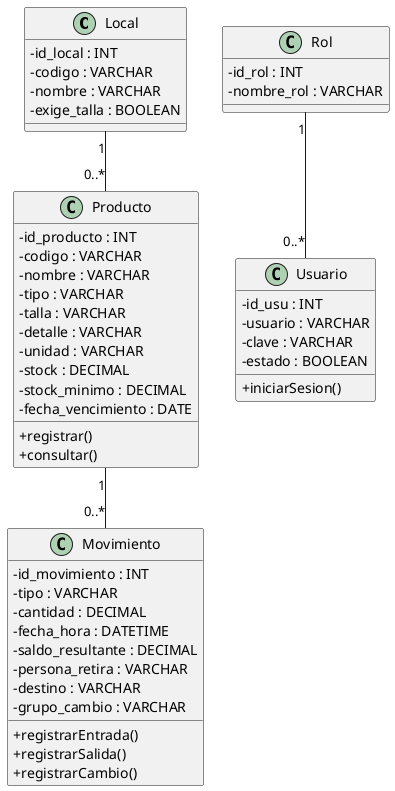
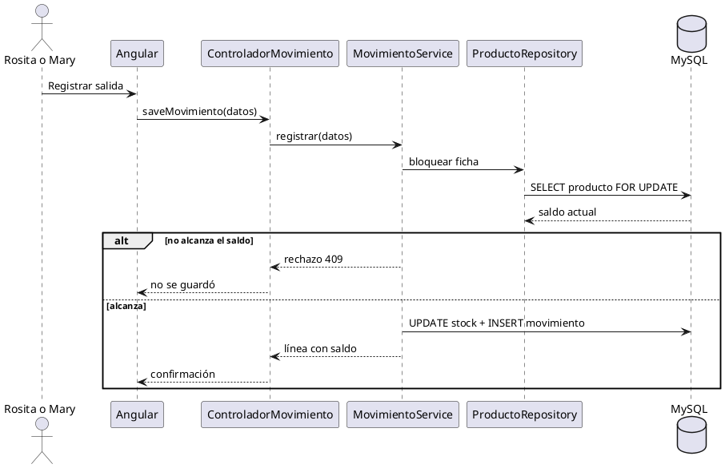

# Documentación de Análisis y Diseño

**Kardex de tienda y depósito**

| Campo | Detalle |
|---|---|
| Proyecto | Kardex para la tiendita de Rosita y el depósito de limpieza del colegio |
| Enfoque | Análisis y diseño de software |
| Alcance | Negocio, requerimientos, casos de uso, modelado de datos y UML |
| Fuentes pendientes | Excel de la tienda y formatos manuscritos de inventario del colegio |

Este documento es el contrato del código. Si una regla cambia, este archivo cambia en el mismo paso. Lo que todavía no está en una fuente se marca como pendiente. No se inventa como requerimiento.

---

## 1. Introducción

Rosita atiende dos locales: uniformes de un colegio y artículos religiosos. Mary controla el depósito de limpieza del colegio en un cuaderno. Los dos problemas son el mismo trabajo: anotar lo que entra, lo que sale y cuánto queda.

## 2. Objetivo del sistema

Llevar un kardex por artículo, en una aplicación web usable desde una tablet, para que el saldo no se pueda corregir a mano y cada movimiento deje rastro.

## 3. Alcance del sistema

Entra:

- Tres locales en la misma aplicación: Uniformes, Artículos religiosos y Limpieza.
- Ficha de producto según el local.
- Movimientos de entrada, salida, devolución y cambio.
- Consulta de la ficha con saldo por línea.
- Aviso de stock en cero o bajo el mínimo.
- Login de quien opera la tablet.

No entra, hasta ver las fuentes:

- Catálogo real.
- Color del uniforme.
- Lotes de vencimiento.
- Proveedor.
- Costo y precio de venta obligatorios.
- Cuentas para el personal que solo recibe material.

## 4. Situación actual y situación propuesta

**Situación actual.** La tienda se lleva en Excel. El depósito lo anota Mary en un cuaderno. No hay un saldo confiable. En el colegio el dolor principal es descubrir que ya no hay. Aunque el depósito se abre con llave, igual anotan quién se lleva el material.

**Situación propuesta.** Una ficha por artículo. El saldo solo cambia cuando se registra un movimiento. La tablet muestra primero lo que está por acabarse.

## 5. Actores del negocio

| Actor | Descripción |
|---|---|
| Rosita | Opera los dos locales de la tienda. Anota entradas, ventas, devoluciones y cambios. |
| Mary | Profesora encargada del depósito. Anota lo que entra y lo que se entrega. |
| Personal del colegio | Recibe material. No opera el sistema. Su nombre queda en el movimiento. |
| Cliente de la tienda | Compra, devuelve o cambia. No opera el sistema. |

## 6. Procesos de negocio

| Proceso | Descripción resumida |
|---|---|
| Dar de alta un artículo | Crear la ficha. En uniformes, tipo y talla definen una ficha distinta. |
| Registrar entrada | Anotar lo que llega y sumar el saldo. |
| Registrar salida | Anotar venta o entrega y restar el saldo. |
| Registrar devolución | Anotar lo que vuelve y sumar, sin tratarlo como compra. |
| Registrar cambio | Anotar lo que vuelve y lo que se lleva, juntos. |
| Consultar kardex | Ver la ficha: fecha, qué pasó, cantidad y saldo. |
| Revisar faltantes | Ver artículos en cero o bajo el mínimo. |

## 7. Reglas de negocio

- El stock no se edita. Solo cambia con un movimiento.
- Una salida mayor que el saldo no se guarda.
- Un cambio es dos líneas. Si la salida no tiene saldo, no se guarda ninguna.
- Chompa talla 8 y Chompa talla 12 son fichas distintas.
- Un artículo religioso no tiene talla: lleva descripción libre en `detalle`.
- La categoría (`tipo`) es obligatoria en los dos locales de la tienda. En uniformes es la columna Categoría. En religiosos es la hoja: Medallas, Vestuario, Accesorios o Imágenes.
- La unidad depende del producto: unidad o galón.
- El vencimiento importa en limpieza. Hoy es una fecha en la ficha, no un lote.
- Hay que poder anotar quién se llevó el material y, si aplica, a dónde fue.
- El costo y el precio de venta pueden ir vacíos.

## 8. Requerimientos y requisitos

| Código | Requerimiento |
|---|---|
| RF01 | Mantener fichas de producto según el local. |
| RF02 | Registrar entradas, salidas y devoluciones. |
| RF03 | Registrar un cambio como dos líneas ligadas. |
| RF04 | Consultar el kardex de un producto con saldo por línea. |
| RF05 | Listar productos sin stock o bajo el mínimo. |
| RF06 | Autenticar a quien opera la tablet. |
| RF07 | Guardar quién retira y el destino, sin obligar a que esa persona tenga usuario. |
| RF08 | Registrar una venta de varios productos en una sola operación atómica. El precio sale de la ficha; si la ficha no tiene precio, la venta se bloquea, pide el precio y lo guarda en la ficha. |
| RF09 | Registrar una compra de varios productos en una sola operación atómica, con el costo por línea. |
| RF10 | Buscar fichas por texto con páginas de a 20 y filtrar por categoría. |
| RF11 | Mostrar inicio con ventas del día y fichas por reponer. |
| RF12 | Editar precio y costo por producto y en lote por prenda, sin tocar el stock. |
| RF13 | Al comprar, el costo de la línea pasa a ser el costo de la ficha. Al vender, la línea guarda el costo del momento. |

| Código | Requerimiento no funcional |
|---|---|
| RNF01 | Usable en una tablet chica, con botones grandes. |
| RNF02 | El saldo y el movimiento se guardan en la misma transacción. |
| RNF03 | Las contraseñas se almacenan cifradas. |
| RNF04 | Una operación inválida no deja saldo a medias. |
| RNF05 | El catálogo provisional no se presenta como el catálogo real. |

## 9. Casos de uso del negocio

| Código | Caso de uso | Actor principal | Precondición | Resultado |
|---|---|---|---|---|
| CUN01 | Dar de alta un artículo | Rosita o Mary | Conocer tipo y talla si es uniforme | Ficha creada |
| CUN02 | Registrar entrada | Rosita o Mary | Ficha existente | Saldo sumado |
| CUN03 | Registrar salida | Rosita o Mary | Hay saldo suficiente | Saldo restado |
| CUN04 | Registrar devolución o cambio | Rosita | Fichas existentes | Movimientos guardados |
| CUN05 | Consultar faltantes | Rosita | Hay fichas | Lista de lo que falta |
| CUN06 | Registrar venta de varios productos | Rosita | Hay saldo en cada ficha | Salidas guardadas o ninguna |
| CUN07 | Registrar compra de varios productos | Rosita | Fichas existentes | Entradas guardadas o ninguna |

## 10. Casos de uso del sistema

| Código | Caso de uso | Descripción |
|---|---|---|
| CUS01 | Mantener productos | Alta, consulta y baja de fichas. La baja se niega si ya hay movimientos. |
| CUS02 | Gestionar movimientos | Entrada, salida y devolución con regla de stock. |
| CUS03 | Gestionar cambio | Dos líneas con el mismo grupo, o ninguna. |
| CUS04 | Consultar kardex | Ficha ordenada en el tiempo, con saldo de cada línea. |
| CUS05 | Autenticar usuarios | Validar a Rosita. |
| CUS06 | Registrar venta | Salidas múltiples con grupo común, o ninguna. |
| CUS07 | Registrar compra | Entradas múltiples con grupo común, o ninguna. |
| CUS08 | Consultar inicio | Ventas del día y faltantes. |

## 11. Especificación de casos de uso del sistema (ECUS)

| Código | Caso de uso | Actor principal | Propósito | Flujo básico |
|---|---|---|---|---|
| ECUS-01 | Mantener productos | Rosita o Mary | Crear la ficha correcta según el local. | Elige local, completa la ficha y guarda. Si es uniforme, indica tipo y talla. |
| ECUS-02 | Gestionar movimientos | Rosita o Mary | Mover el saldo sin editarlo. | Elige el producto, el tipo y la cantidad. El sistema calcula el saldo. |
| ECUS-03 | Gestionar cambio | Rosita | No dejar una punta del cambio sin la otra. | Indica qué vuelve y qué se lleva. El sistema guarda las dos líneas o rechaza las dos. |
| ECUS-06 | Registrar venta | Rosita | Cobrar varios productos de una vez con comprobante. | Busca fichas, pone cantidades y confirma. El sistema crea la cabecera con número y total, y las salidas con precio de ficha. Si falta stock, no guarda nada. |
| ECUS-07 | Registrar compra | Rosita | Registrar lo que llegó del proveedor con comprobante. | Busca fichas, pone cantidades y costos, y confirma. El sistema crea la cabecera y las entradas. |
| ECUS-04 | Consultar kardex | Rosita o Mary | Leer la ficha como el cuaderno. | Abre el producto y ve fecha, tipo, cantidad y saldo. |
| ECUS-05 | Autenticar usuarios | Rosita o Mary | Entrar a la tablet. | Escribe usuario y clave. El sistema abre los locales. |

## 12. Modelo conceptual de entidades

| Entidad | Descripción |
|---|---|
| Local | Uniformes o Artículos religiosos. Dice si la ficha exige talla. Limpieza queda pendiente. |
| Producto | Ficha de kardex. Stock, unidad, mínimo, detalle y vencimiento opcional. |
| Movimiento | Línea del kardex. Tipo, cantidad, saldo resultante, quién retira y destino. Apunta a su venta o compra. |
| Venta | Cabecera de una venta: número, fecha, total y quién vendió. |
| Compra | Cabecera de una compra: número, fecha, total y motivo. |
| Usuario | Cuenta de quien opera la tablet. Hoy solo Rosita. |
| Rol | Papel de la cuenta. Hoy no parte la pantalla. |

Relaciones:

- Local 1:N Producto
- Producto 1:N Movimiento
- Venta 1:N Movimiento
- Compra 1:N Movimiento
- Rol 1:N Usuario

No hay herencia. No hay proveedor. El cambio no es otra entidad: son dos movimientos con el mismo `grupo_cambio`.

## 13. Modelo relacional

```text
ALMACEN
  id_local        INT PK AUTO_INCREMENT
  codigo          VARCHAR(30) UNIQUE NOT NULL
  nombre          VARCHAR(80) NOT NULL
  exige_talla     BOOLEAN NOT NULL

PRODUCTO
  id_producto     INT PK AUTO_INCREMENT
  id_local        INT NOT NULL FK -> ALMACEN(id_local)
  codigo          VARCHAR(40) NOT NULL
  nombre          VARCHAR(120) NOT NULL
  tipo            VARCHAR(40) NOT NULL
  talla           VARCHAR(20) NULL
  detalle         VARCHAR(120) NULL
  unidad          VARCHAR(10) NOT NULL
  stock           DECIMAL(12,2) NOT NULL
  stock_minimo    DECIMAL(12,2) NULL
  fecha_vencimiento DATE NULL
  costo_referencia DECIMAL(12,2) NULL
  precio_venta    DECIMAL(12,2) NULL
  activo          BOOLEAN NOT NULL
  UNIQUE (id_local, codigo)

MOVIMIENTO
  id_movimiento   INT PK AUTO_INCREMENT
  id_producto     INT NOT NULL FK -> PRODUCTO(id_producto)
  tipo            VARCHAR(20) NOT NULL
  cantidad        DECIMAL(12,2) NOT NULL
  fecha_hora      DATETIME NOT NULL
  saldo_resultante DECIMAL(12,2) NOT NULL
  persona_retira  VARCHAR(80) NULL
  destino         VARCHAR(80) NULL
  costo_unitario  DECIMAL(12,2) NULL
  precio_unitario DECIMAL(12,2) NULL
  grupo_cambio    VARCHAR(36) NULL
  grupo_venta     VARCHAR(40) NULL
  grupo_compra    VARCHAR(40) NULL
  motivo          VARCHAR(120) NULL

ROL
  id_rol          INT PK AUTO_INCREMENT
  nombre_rol      VARCHAR(50) UNIQUE NOT NULL

USUARIO
  id_usu          INT PK AUTO_INCREMENT
  usuario         VARCHAR(100) UNIQUE NOT NULL
  clave           VARCHAR(255) NOT NULL
  estado          BOOLEAN NOT NULL
  id_rol          INT NOT NULL FK -> ROL(id_rol)
```

Observaciones:

- `tipo` del movimiento es `ENTRADA`, `SALIDA` o `DEVOLUCION`.
- El lado que vuelve en un cambio se guarda como `DEVOLUCION`. El lado que se lleva, como `SALIDA`. Los une `grupo_cambio`.
- Las líneas de una venta apuntan a su cabecera `venta`; las de una compra, a `compra`. El recibo se abre en un panel lateral, igual que el detalle desde el kardex. El precio de la línea sale de la ficha; si falta, se pide en la venta y queda guardado en la ficha.
- `stock` no tiene endpoint de edición.

## 14. Normalización de la base de datos

| Forma normal | En este modelo |
|---|---|
| 1FN | Tipo y talla no van en una sola celda. Cada ficha tiene un tipo y una talla, o ninguno. |
| 2FN | La clave de producto es simple. El par local + código es único, y los atributos dependen de esa ficha. |
| 3FN | El nombre del local no se repite en el producto. Vive en `LOCAL`. Quién retira no es un usuario: es un dato del movimiento. |

Si Chompa talla 8 y talla 12 vivieran en una fila, el saldo mentiría. Separar la ficha evita eso.

## 15. Diagramas UML

El dibujo verde al estilo de `Diagrama BD.png` se regenera desde el PlantUML de la sección 16. La fuente manda. El PNG es salida, no otra versión del modelo.

### 15.1 Casos de uso

Rosita y Mary mantienen productos, registran movimientos y consultan el kardex. Solo Rosita registra cambios de tienda. Mary consulta faltantes. El personal no es actor del sistema.

### 15.2 Actividades: registrar salida

1. Elige el producto.
2. Indica la cantidad y, si aplica, quién se lo lleva.
3. Si la cantidad supera el saldo, el sistema avisa y no guarda.
4. Si alcanza, resta, guarda la línea con el saldo nuevo y confirma.

### 15.3 Secuencia

| Caso | Flujo |
|---|---|
| Registrar salida | Operador → Angular → ControladorMovimiento → MovimientoService → ProductoRepository y MovimientoRepository → MySQL |
| Registrar cambio | Operador → Angular → ControladorMovimiento → MovimientoService → las dos fichas, en una transacción → MySQL |

## 16. Código PlantUML de referencia

### 16.1 Diagrama de clases



### 16.2 Secuencia: registrar salida



## Pendiente de fuente

| Tema | Qué falta | Qué se hizo mientras tanto |
|---|---|---|
| Catálogo | Excel de Rosita y formatos de Mary | Unos productos de muestra, marcados como provisionales |
| Color | Si el Excel lo trae | No está en la ficha |
| Lote | Si el formato trae el mismo producto con dos vencimientos | Una fecha opcional en el producto |
| Costo y precio | Si Rosita ya los anota | Columnas opcionales, no obligatorias |
| Tablet | Tamaño real al prenderla | Botones grandes igual |
